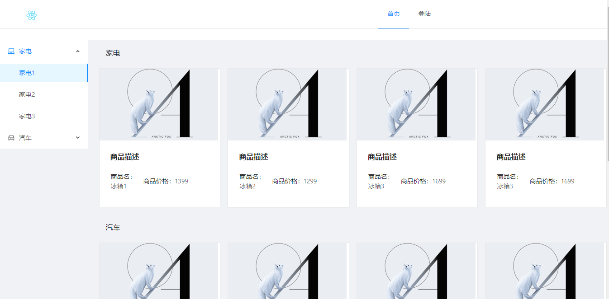
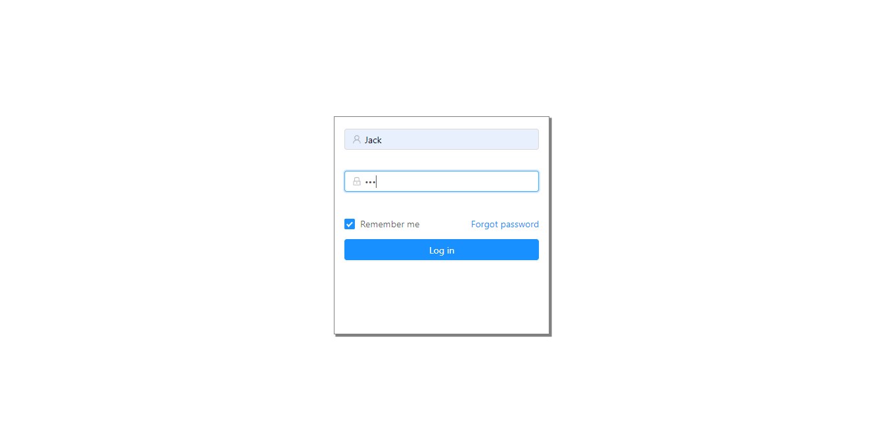
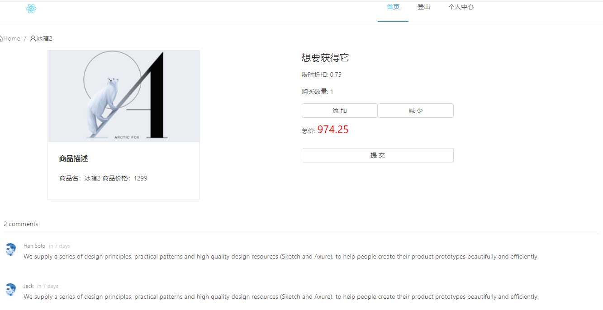
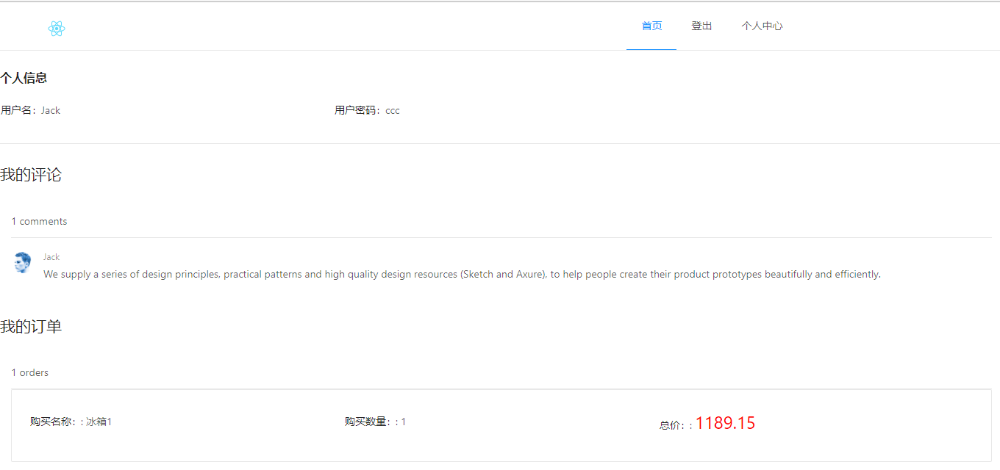

# React简单应用

## 思路与构造

利用React-Router搭建了四个页面，首页`/`, 商品详情页`/goods/:kind/:id`,登录页`/login`,个人中心页`/space`,公共组件头部`Header`导航，尾部`Footer`许可。

首页拿到商品列表并提供链接

登录页实现登录功能

商品详情页提供商品详细信息并处理购买逻辑，还有评论

个人中心页展示个人信息、订单和评论

## 可执行脚本

### `npm start`

在开发环境在执行 
用浏览器打开 [http://localhost:3000](http://localhost:3000)

文件更改之后会自动刷新. 

### `npm test`

执行测试

### `npm run build`

构建应用，除去不必要的文件并压缩文件

### `npm run eject`

**注意：脚本只能执行一次，不能反向执行**

弹出配置信息，可以进行自定义配置
